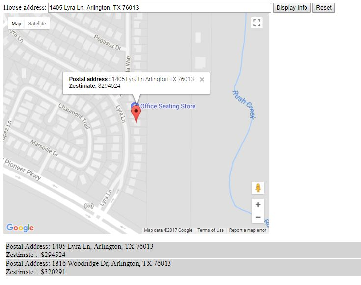

# Home Locator
JavaScript, Zillow and Google Maps API

Home Locator helps the user locate a home by
        - searching the address (OR)
        - clicking on the map

 Home Locator searching if there are matching zillow listings to the 
 address that the user entered, if so, it displays location on the map 
 along with the zillow estimate. 

 The user can also select a point on the map. If the location is a zillow 
 listing the zillow estimate is displayed.

 All the locations that the user has searched are listed in the text area.

## How to run ?

Clone the repository into your htdocs diretory under xampp. 
Insert your API keys for Google maps in map.html and Zillow API in map.js.
Run Apache server
Open map.html on the browser

## Contributing

1. Fork it!
2. Create your feature branch: `git checkout -b my-new-feature`
3. Commit your changes: `git commit -am 'Add some feature'`
4. Push to the branch: `git push origin my-new-feature`
5. Submit a pull request :D

## License

Abhinaya Ramachandran 2017
